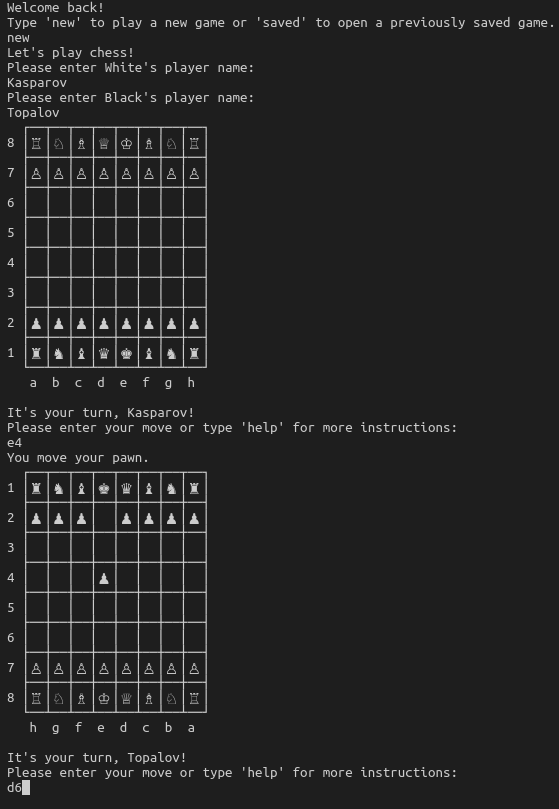

# Chess
This is a command line chess game, where two players can enter moves to play against each other. It was done as the final assignment for the Ruby course part of [The Odin Project](https://www.theodinproject.com/lessons/ruby-final-project).

## Approach
My main goal for this project was to apply the object-oriented design principles that I just learned from [this book](https://www.poodr.com/) as much as I could. 

Additionally, I wanted to implement as many of the rules of classic chess as possible (as described [here](https://www.chessvariants.com/d.chess/chess.html)). That means that I had to allow castling and en-passant taking moves.

The only significant rule I left out is pawn promotion. However, given the way the components of my program are set up, I feel this would be easy to add later.

## Features
- The game can be saved at any time.
- When there are saved games, the user is prompted to choose either to start a new game or to continue a saved game.
- The board is displayed with the conventional column-letters and row-numbers.
- The board is shown from the perspective of the current player.
- To make a move, players type in a command such as 'knight to c3'. Most variations of this (for example 'C 3 Knight') will also work.  
- Following convention, I made naming the square (ex. 'e4') sufficient for pawn moves.
- When more than one piece can move to the given square, a player is given a list of possibilities with the option to choose which piece they want to move.
- Players can give commands such as 'help', 'resign', 'save' or 'quit' at any time.

